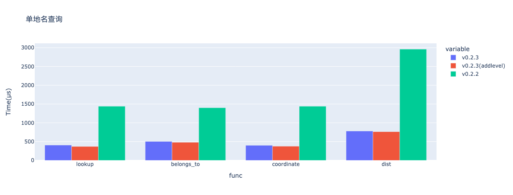

## Version0.2.3更新部分
对[cp_lookup](../api/cp_lookup.md)模块更换pandas为polars前后，v0.2.2和v0.2.3两个版本不同函数查询速度的测试。

### 单地名查询
使用v0.2.3不添加`level`参数的函数和添加`level`参数的函数，以及v0.2.2的函数进行单区域名查询速度测试，查询地名统一为桂林（dist函数通过参数固定为计算桂林与成都之间的球面距离），结果如下：

### 多地名查询
考虑到pandas依然是最主流的python数据帧库，这一步还是使用pandas而非polars进行测试。利用pandas导入一个包含区域名简称的面板数据，共20736行（区域名简称大量重复）。通过pandas的`apply`函数，结合v0.2.3不添加`level`参数的函数和添加`level`参数的函数，以及v0.2.2的函数对该数据的区域名简称列进行多区域名查询速度测试（dist函数通过参固定为计算与成都之间的球面距离），结果如下：

### 测试结论
版本更新之后，[cp_lookup](../api/cp_lookup.md)模块各函数的查询速度均提高近两倍，同时可以看到新版本中各函数
添加`level`参数后查询速度亦有些微提升，尽管幅度不大。